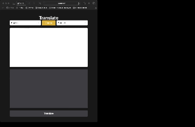

<h1>Translate Website<h1>

I created a simple Translate website with using Redux Toolkit, tailwind which is used custom API.

Website:
Source Code & More :

<h2>React-Redux Toolkit axios<h2>
<h2>Link: https://simpletranslateapp.netlify.app<h2>
<h2> Screen <h2>

# Libraries

- axios
- @reduxjs/toolkit
- react-redux
- react-select
- tailwind
